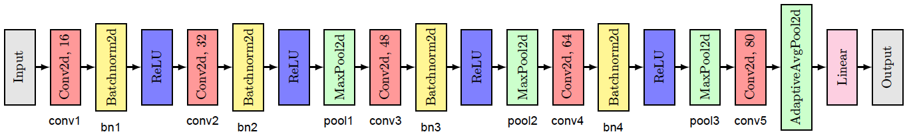
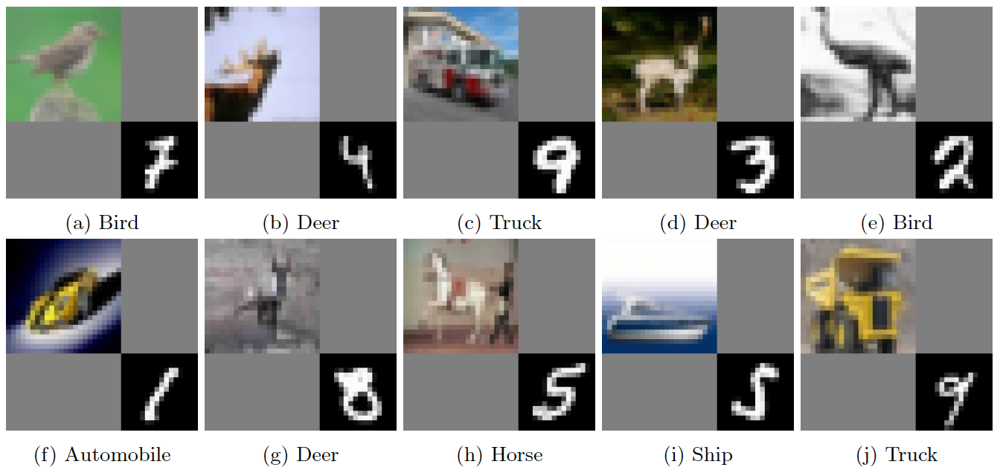
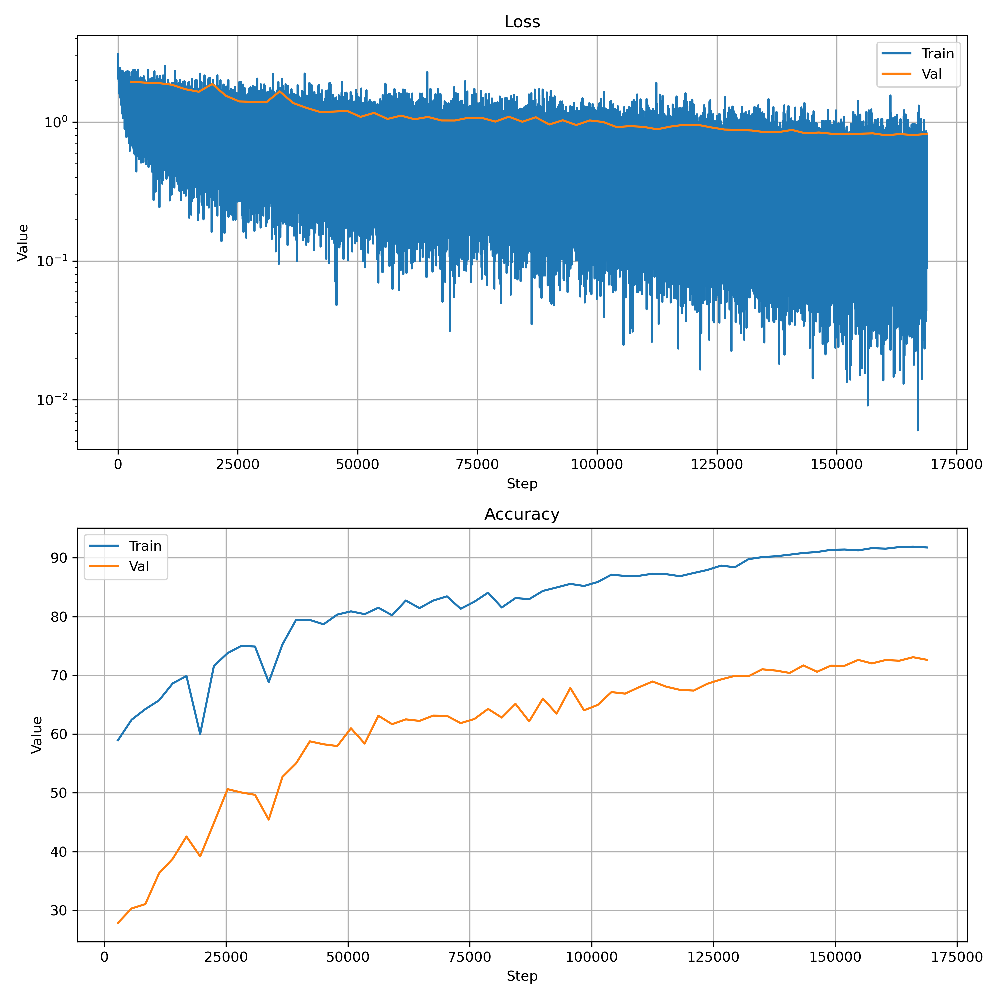

# DeepLearning-Project-2-Convolutional-Neural-Networks
In this project, we aim for developing a CNN model to perform the classification task of a composite [dataset](https://drive.google.com/file/d/1AjW9I4YJKIwoqbkrkophr0E2O_8gDerj/view?usp=sharing) (combination of CIFAR-10 and MNIST). We also delved deeper in the CNN model via visualizing the filters and comparing the early and later layers.

This project was developed as part of CSE 849 (Deep Learning - Spring 25 Semester) at the Computer Science Department of Michigan State University, taught by Dr. Zijun Cui (@zijunjkl), with TA support from Gautam Sreekumar (@gautamsreekumar). Special thanks to them for their guidance and materials.
